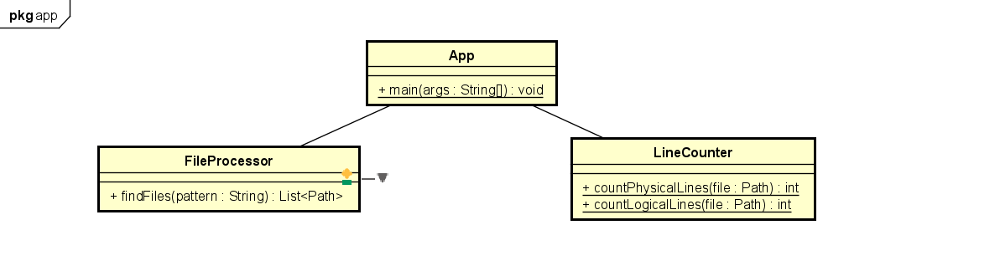
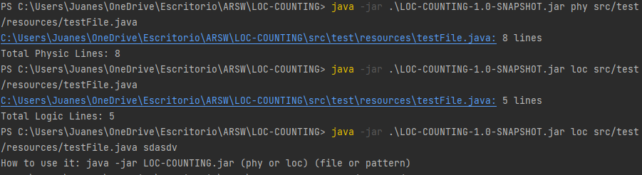

# LOC-COUNTING

This project is a command-line tool to count lines of code (LOC) in source files, supporting both physical and logical lines counting, along with wildcard and recursive file selection.

## Getting Started

Follow these instructions to set up and run the LOC-COUNTING application on your local machine.

### Prerequisites

Ensure you have the following installed:

- **Java Development Kit (JDK)** - Version 8 or higher. Verify by running:
  ```sh
  java -version
  ```

- **Apache Maven** - Dependency and build management tool. Verify by running:
  ```sh
  mvn -version
  ```

### Installing

1. **Clone the repository:**
   ```sh
   git clone https://github.com/your-username/LOC-COUNTING.git
   cd LOC-COUNTING
   ```

2. **Build the project using Maven:**
   ```sh
   mvn clean package
   ```

### Running the Application

To count lines of code in a file or directory, use the following command structure:

```sh
java -jar target/LOC-COUNTING-1.0-SNAPSHOT.jar <option> <file or pattern>
```

Replace `<option>` with `phy` to count physical lines or `loc` to count logical lines. `<file or pattern>` can be a single file or a wildcard pattern (e.g., `*.java`) for multiple files.

### Example Usage

Count physical lines in a single file:
```sh
java -jar target/LOC-COUNTING-1.0-SNAPSHOT.jar phy path/to/file.java
```

Count logical lines recursively in a directory:
```sh
java -jar target/LOC-COUNTING-1.0-SNAPSHOT.jar loc path/to/directory/**/*.java
```

### Tests

JUnit tests are included to verify the functionality of the application. To run tests, execute:
```sh
mvn test
```

## Project Structure

### Class Diagram




### Classes

- **App.java**: Main class of the application. It provides a command-line interface to count lines of code in specified files or directories based on user input (`phy` for physical lines, `loc` for logical lines).

- **FileProcessor.java**: Handles file and directory operations, including finding files based on patterns and recursively.

- **LineCounter.java**: Contains methods to count physical and logical lines in a given file.

### Tests

- **AppTest.java**: JUnit tests for the `App.java` class. Verifies correct functionality for counting lines of code based on user input options (`phy`, `loc`) and handling invalid inputs.

- **FileProcessorTest.java**: Tests for the `FileProcessor.java` class, ensuring correct file and directory handling, including wildcards and recursive file selection.

- **LineCounterTest.java**: JUnit tests for the LineCounter.java class. Verifies the accuracy of counting physical and logical lines in a specified file.
  



## Built With

- [Java](https://www.oracle.com/java/technologies/) - Programming Language
- [Apache Maven](https://maven.apache.org/) - Dependency Management

## Author

- Juan esteban Ortiz
- GitHub: (https://github.com/juaneortiz1/LOC-COUNTING)


